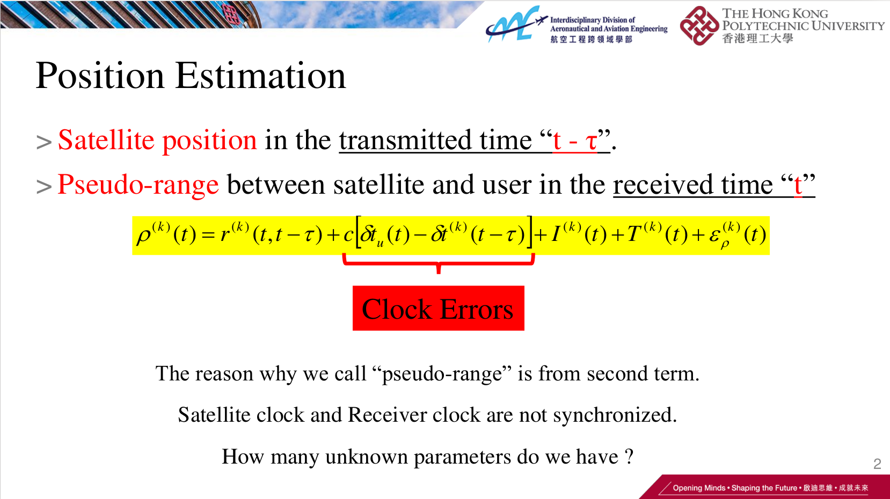
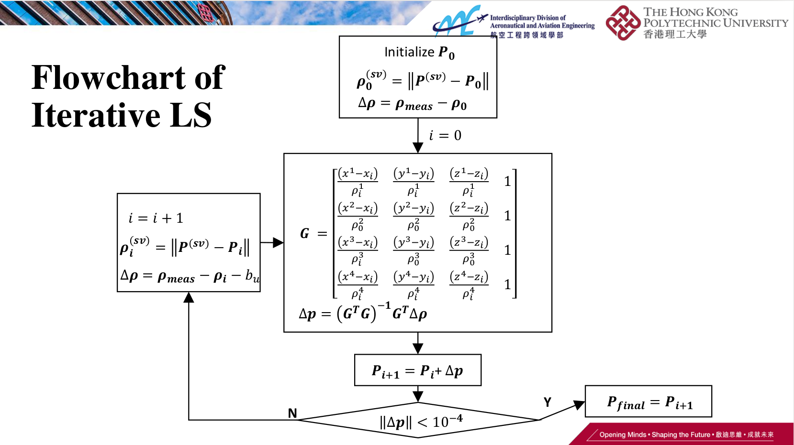
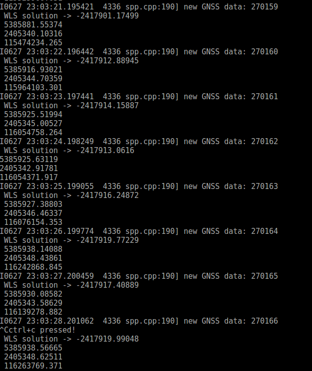

# NavCodeMonitor
### A package for monitoring the code of navigation purpose

This repository is the implementation of the GNSS weighted least square (WLS) positioning. The input is the pseudorange measurements from multiple satellites. The states to be estimated are the position **(x, y, z)** of the GNSS receiver in ECEF frame and the receiver clock bias.

**Authors**: [Weisong Wen](https://weisongwen.wixsite.com/weisongwen), [Li-ta Hsu](https://www.polyu-ipn-lab.com/) from the [Intelligent Positioning and Navigation Laboratory](https://www.polyu-ipn-lab.com/), The Hong Kong Polytechnique University


<p align="center">
  
</p>
<center> Measurement model of pseudorange measurements.</center>

<p align="center">
  
</p>

<center> Software flowchart of GNSS positioning.</center>

## 1. Prerequisites
### 1.1 **Ubuntu** and **ROS**
Ubuntu 64-bit 16.04.
ROS Kinetic. [ROS Installation](http://wiki.ros.org/ROS/Installation)


### 1.2. **Eigen and Dependency**
```bash
# CMake
sudo apt-get install cmake
# google-glog + gflags
sudo apt-get install libgoogle-glog-dev
# BLAS & LAPACK
sudo apt-get install libatlas-base-dev
# Eigen3
sudo apt-get install libeigen3-dev
# Novatel msgs
sudo apt-get install ros-kinetic-novatel-msgs
```
### 1.3. **Ceres Solver**
Follow [Ceres Installation](http://ceres-solver.org/installation.html).

## 2. Build NavCodeMonitor
Clone the repository and catkin_make:
```bash
mkdir NavCodeMonitor/src
cd ~/NavCodeMonitor/src
git clone https://github.com/weisongwen/NavCodeMonitor.git
cd ../
# if you fail in the last catkin_make, please source and catkin_make again
catkin_make
source ~/NavCodeMonitor/devel/setup.bash
catkin_make
```
(if you fail in this step, try to find another computer with clean system or reinstall Ubuntu and ROS)

## 3. Run example using dataset provided in **data folder**   
The NavCodeMonitor is validated using static dataset collected near TST of Hong Kong. Several parameters are as follows:
  - GPS second span: **270147** to **270332**
  - satellite system: **GPS/BeiDou** (you can choose GPS only or GPS/BeiDou fusion)

```bash
source ~/NavCodeMonitor/devel/setup.bash
cd ~/NavCodeMonitor
# read GNSS raw data and publish as ROS topic
rosrun global_fusion spp_node

```
<p align="center">
  
</p>
<center> result</center>

**Related Papers:** (paper is not exactly same with code)
1. Wen, Weisong, Guohao Zhang, and Li-Ta Hsu. "Exclusion of GNSS NLOS receptions caused by dynamic objects in heavy traffic urban scenarios using real-time 3D point cloud: An approach without 3D maps." Position, Location and Navigation Symposium (PLANS), 2018 IEEE/ION. IEEE, 2018. 

2. Wen, W., Zhang, G., Hsu, Li-Ta (Presenter), Correcting GNSS NLOS by 3D LiDAR and Building Height, ION GNSS+, 2018, Miami, Florida, USA.

*if you use GraphGNASLib for your academic research, please cite our related [papers](https://www.polyu-ipn-lab.com/)*